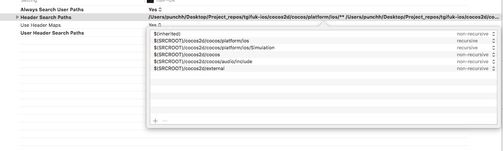
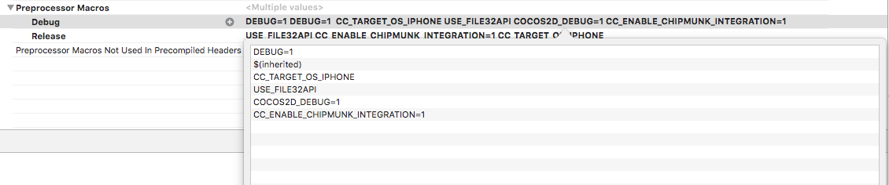

Integrating cocos2d-x game into existing iOS project.
=======

Cocos2d-x is a cross platform game engine. We can add existing cocos2d-x game into our native application code by following these steps:

- Download cocos2d-x from [here](http://www.cocos2d-x.org/download).

- Copy cocos2d folder to your project directory.

- Go to cocos2d-x > build folder.

- Link cocos2d_libs project:
  * Open your iOS project and drag and drop `cocos2d_libs.xcodeproj` into your project.
  * Link libcocos2d iOS.a binary to your project.

- Add following entries to `Header search path` build settings:
  * $(SRCROOT)/cocos2d/cocos/platform/iOS
  * $(SRCROOT)/cocos2d/cocos/platform/iOS/Simulation
  * $(SRCROOT)/cocos2d/cocos
  * $(SRCROOT)/cocos2d/cocos/audio/include
  * $(SRCROOT)/cocos2d/external



- Add following entries to `Preprocessor Macros` Debug Build Settings:
  * CC_TARGET_OS_IPHONE
  * USE_FILE32API
  * COCOS2D_DEBUG=1
  * CC_ENABLE_CHIPMUNK_INTEGRATION=1



- Set `PNG Compression` & `Remove Text Meta Data` build settings to `NO`.

- Add following frameworks:
  * libiconv.dylib
  * Security.framework
  * CoreMotion.framework
  * Foundation.framework
  * UIKit.framework
  * CoreGraphics.framework
  * OpenGLES.framework
  * libz.dylib
  * QuartzCore.framework
  * OpenAL.framework
  * AVFoundation.framework
  * AudioToolbox.framework
  * MediaPlayer.framework

#### Common Pitfalls

- Please make sure that you have defined a static variable of your AppDelegate in your AppController/AppDelegate with name `s_sharedApplication`.

```obj-c
static AppDelegate s_sharedApplication;
```

- Please make sure that `ARC` is off for the class where you are creating and adding the CCEAGLView object.

- Restrict all your objective-c imports/preprocessors within a `#ifdef __OBJC__` block

```obj-c
#ifdef __OBJC__
  #import <UIKit/UIKit.h>
  #import <Foundation/Foundation.h>
#endif
```
